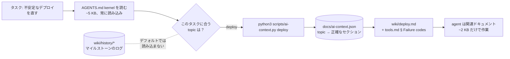
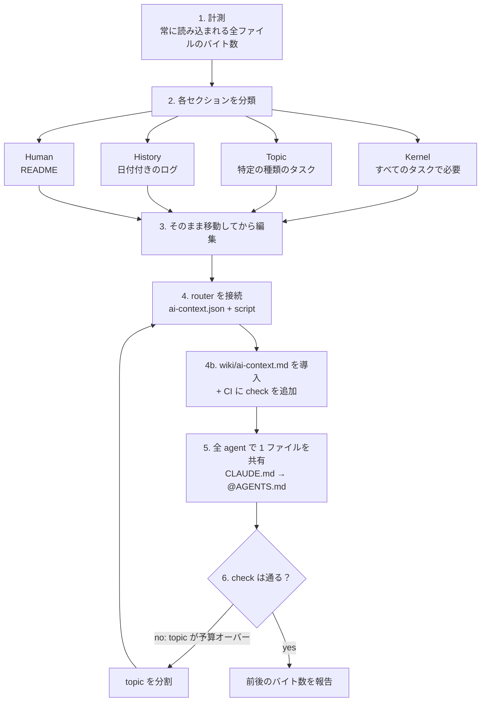
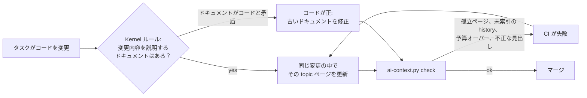

# agents-context-router

[English](README.md) | **日本語** | [한국어](README.ko.md) | [简体中文](README.zh-CN.md) | [繁體中文](README.zh-TW.md)

**あなたの `AGENTS.md` は、すべてのタスクに課される「税金」です。** この skill はそれを 5 KB の kernel にまで削ぎ落とし、残りはタスクが必要とするときだけ agent に読み込ませます。

どの coding agent（Claude Code、Codex、Cursor、Gemini CLI）も、何かを始める前にまずルートの指示ファイルを読みます。プロジェクトが半年も経てば、そのファイルにはマイルストーンのログ、ツール一覧、デプロイの runbook、デバッグ日誌、そして 400 行目に埋もれた最重要ルールがひとつ、という状態になります。たった 1 行のタイポ修正でさえ、そのすべてのコストを context、token、そして注意力で支払うことになるのです。

さらに悪いことに、本当に大事なルールほど埋もれてしまいます。14 KB の `AGENTS.md` を想像してください。*「shared 環境では絶対に `make reset-db` を実行しない」* という唯一の記述が、どの agent も丁寧には読まない 2026-03 の受け入れログの中に紛れ込んでいるのです。

<p align="center">
  
</p>

```
Before                                  After
────────────────────────────────────    ─────────────────────────────────────────────
AGENTS.md    14 KB  every task          AGENTS.md              3–5 KB  every task
CLAUDE.md     3 KB  drifted copy        CLAUDE.md              @AGENTS.md (1 line)
README.md    85 KB  "read this first"   docs/ai-context.json   topic → exact sections
                                        scripts/ai-context.py  list | <topic> | check
                                        wiki/<topic>.md        loaded only when needed
                                        wiki/history/*.md      never loaded by default
```

これは実際のプロダクションリポジトリから生まれました。85 KB の README と長大な `AGENTS.md` が、**5 KB の kernel と、それぞれ 1.5〜10 KB の 9 つの topic** に生まれ変わりました。agent が大事なルールを読み飛ばすことはなくなりました。

## タスクが context を読み込む流れ



kernel は小さいままなので、agent はそれを丁寧に読みます。各 topic はタスクが必要とするときだけ読み込まれ、history は誰かが求めるまで邪魔になりません。

<p align="center">
  
</p>

## ユーザーストーリー

> **「Codex が冒頭のルールを無視し続ける」** ある個人開発者の `AGENTS.md` は、スプリントメモと make ターゲットの表で 38 KB にまで膨らみ、重要なルールがノイズに埋もれていました。skill はそれを 4 KB の kernel に削り、絶対に守るべき制約を冒頭に置きます。スプリントメモは `wiki/history/` へ移り、make ターゲットは `build` topic になります。

> **「Claude Code と Codex でポート範囲の認識が食い違う」** あるチームは `CLAUDE.md` と `AGENTS.md` を丸ごとのコピーとして管理していましたが、数か月前から内容がずれていました。skill はそれらをひとつの `AGENTS.md` に統合します。`CLAUDE.md` は `@AGENTS.md` になります。2 つの矛盾点は人間が判断できるよう表にまとめられます。黙ってどちらかを選べば、デプロイを壊しかねないからです。

> **「痛い目を見て学んだ教訓を、また忘れてしまった」** インシデントの後、誰かが 2 ページのポストモーテムを `AGENTS.md` に追記しました。skill はその教訓を 1 行の kernel ルール（「すべてのベンダーが同時に失敗したら、まず自分たちのネットワークを疑う。`debugging` を読み込む」）として残し、全文はそのまま history へ移します。

> **「runbook をひとつ追加したいだけ」** 数か月後、メンテナーがリトライポリシーの runbook を追加します。skill はそれを topic ページに置き、JSON にマッピングし、kernel には表の行を 1 行だけ追加します。`check` によって、kernel の増加は 2 KB ではなく 89 バイトだと確認できます。

> **「3 か月後、その wiki はまだ正しい？」** あるチームメイトがリトライのロジックを変更し、kernel ルールに従って同じ PR で `wiki/retry-policy.md` も更新します。別のメンバーは `wiki/cache.md` を追加したものの、マッピングを忘れました。そのページがすべての agent から見えなくなる前に、`check` が CI で *"wiki page no topic loads"* と失敗します。

> **「CI で topic が予算オーバーと言われた」** `check` が `deploy: 21003 B > 16384` で失敗します。skill は上限を引き上げません。`deploy` を `release` と `rollback` に分割します。それほど大きな topic は、実際には 2 つのタスクだからです。

## agent がこの skill でやること

*「AGENTS.md が大きすぎるから分割して」* と伝えるだけで、agent は 6 つのステップを進めます。



1. **計測**：常に読み込まれるものをすべて測ります。
2. **分類**：すべてのセクションを kernel、topic、history、human の 4 つのいずれかに振り分けます。判断基準は *「この行がなかったら、無関係なタスクで誤った行動が起きるか？」* です。
3. **原文のまま移動**してから編集するので、何かが黙って消えることはありません。
4. **router を接続**：各 topic を正確なセクションに対応づける JSON マップと、依存ゼロのスクリプトを用意します。
5. **すべての agent が 1 つのファイルを共有**：ずれたコピーは 1 行の `@AGENTS.md` ポインタになり、矛盾は黙って解決されるのではなく、あなたに提示されます。
6. **検証**：`check` で確認し、前後のバイト数を報告します。

以降、すべてのタスクはこのように始まります。

```sh
$ python3 scripts/ai-context.py list
build-deploy       Repo layout, build and test commands, deploy procedure.
debugging          Something fails: triage order, logs, known failure codes.
cli-tools          tp-replay / tp-audit usage and flags.

$ python3 scripts/ai-context.py debugging     # prints ONLY what debugging needs
<!-- wiki/debugging.md -->
## Debugging
...
<!-- wiki/tools.md § Failure codes -->
### Failure codes
...
```

## 自分でファイルを分割すればいいのでは？

できます。でも 1 か月もすれば元に戻ってしまいます。「`docs/` に移すだけ」に加えて、この skill が提供するものは次のとおりです。

| なし | あり |
|---|---|
| agent が「念のため」`docs/*` を読み込む | kernel が指示：topic は **1 つ**だけ選び、2 つ目は境界をまたぐときだけ読み込む |
| 行番号による参照は編集のたびに壊れる | **正確な見出し**による参照。見出しが変更・重複すると **fail closed** する |
| シェルブロック内の `# comment` 行が見出しとして解析される | パーサーはフェンス付きコード内の見出しを無視する |
| kernel がじわじわ 20 KB に戻る | `check` が **バイト予算**（kernel 8 KB、topic ごとに 16 KB）を強制し、対処は分割のみ、上限は決して引き上げない |
| どの agent も知らない新しい topic | `AGENTS.md` の表に topic がなければ `check` が失敗する |
| `CLAUDE.md` と `AGENTS.md` が知らぬ間に食い違う | 情報源は 1 つ。もう一方の agent にはポインタファイル |
| skill がルールを書き直して分岐させる | skill は「topic X を読み込む」と伝えるだけのアダプターになる |
| ルールが history のログに埋もれる | 分類の工程でそれらを kernel に引き上げる |
| リファクタリングの 1 か月後にはドキュメントが腐る | **自己メンテナンス**：古いドキュメントを同じ変更で直す kernel ルール、リポジトリ内のマニュアル、CI での孤立チェック |

さらに [`references/gotchas.md`](skills/agents-context-router/references/gotchas.md) も同梱しています。実際の分割作業で出会った 21 の落とし穴を、それぞれがなぜ厄介なのかという理由とともにまとめたものです。このファイルだけでも star する価値があります。

## 本当に効果があるの？

同じモデルで、skill あり・なしの両方で 3 つの現実的なタスクを実行しました。
- 14 KB の `AGENTS.md` を分割する
- ずれてしまった `CLAUDE.md` を統合する
- すでに router 化されたリポジトリに runbook を追加する

すべての出力はスクリプトによるチェックで採点しました。

| | skill あり | なし |
|---|---|---|
| 通過したチェック | **33 / 33 (100%)** | 21 / 33 (64%) |

ベースラインが見落としたもの：
- 変動しやすいステータス（"41/120 done"）を常に読み込まれるファイルに残した。
- デプロイ用の skill に独自のルールのコピーを残した。
- topic を読み込む手段も、予算を強制する手段も用意しなかった。
- マイルストーンのログをそのまま移動せず、書き換えてしまった。
- 自己メンテナンスの仕組みをまったく導入しなかった。ドキュメントを正しく保つルールも、リポジトリ内のマニュアルも、孤立チェックもなし。

途中でリグレッションを 1 つ検出しました。初期のリビジョンでは、古いログに埋もれていたルール（「shared 環境では絶対に `make reset-db` を実行しない」）が history に紛れ込んでしまったことがあります。現在の skill は、ログを移動する前に生きたルールがないかを grep で確認するようになり、再実行ではパスしました。

skill を使うと、1 回あたり約 25 秒と 6k token が余分にかかります。サンプルは小規模です（n = タスク・リビジョンごとに 1 回の実行）。プロンプトは [`evals/`](skills/agents-context-router/evals/) にあるので、ぜひ結果を再現して PR を送ってください。

## クイックスタート

### plugin としてインストール

#### Claude Code

```text
/plugin marketplace add runkids/agents-context-router
/plugin install agents-context-router@agents-context-router
```

#### Codex

```bash
codex plugin marketplace add runkids/agents-context-router
codex
```

Codex で `/plugins` を開き、**agents-context-router** を選んでインストールします。利用を始めるには新しいセッションを開いてください。

#### [Skillshare](https://github.com/runkids/skillshare) を使う

Skillshare を使っているなら、ひとつのコマンドで Claude Code と Codex にこの native plugin をインストールでき、Agent ごとのインストール状況や設定も管理できます。

```bash
skillshare plugin add runkids/agents-context-router --plugin agents-context-router --target claude --target codex --global
skillshare sync plugins
```

[複数の coding agent に対応する Skillshare](https://skillshare.runkids.cc/docs/reference/commands/plugin/) なら、plugin の管理もひとつの場所にまとめられます。

### [Skillshare](https://github.com/runkids/skillshare) で skill としてインストール

```bash
# global: every project on this machine
skillshare install runkids/agents-context-router
skillshare sync

# project only: installs into ./.skillshare/skills
skillshare install runkids/agents-context-router -p
skillshare sync -p
```

### [Vercel Skills CLI](https://github.com/vercel-labs/skills) を使う

```bash
# project (default): installs for the agents detected in this repo
npx skills add runkids/agents-context-router

# global, for every agent
npx skills add runkids/agents-context-router -g -a '*'
```

### 手動

```bash
git clone https://github.com/runkids/agents-context-router
cp -r agents-context-router/skills/agents-context-router ~/.claude/skills/   # Claude Code
cp -r agents-context-router/skills/agents-context-router ~/.codex/skills/    # Codex
```

あとは任意のリポジトリで次のように伝えるだけです。

> **「AGENTS.md が大きすぎる。kernel と wiki の topic に分割して」**

ほかの言い方でも起動します。たとえば「CLAUDE.md と AGENTS.md の内容がずれてる」「毎セッションでマイルストーンの履歴を読み込むのをやめて」「AGENTS.md を太らせずにこの runbook を追加して」など。

## 30 秒でわかる router

`docs/ai-context.json` が唯一の信頼できる情報源（single source of truth）です。

```json
{
  "budgets": { "rootInstructionsMaxBytes": 8192, "defaultTopicMaxBytes": 16384 },
  "topics": {
    "debugging": {
      "description": "Something fails: triage order, logs, known failure codes.",
      "sources": [
        { "path": "wiki/debugging.md" },
        { "path": "wiki/tools.md", "heading": "Failure codes" }
      ]
    }
  }
}
```

source はファイル全体か、1 つの正確な見出しのどちらかです。セクションは、同じかそれより上位のレベルの次の見出しまで続きます。出力される各セクションには `<!-- path § heading -->` マーカーが付くので、agent はレンダリングされたコピーではなく元のファイルを編集します。

`scripts/ai-context.py` は依存関係ゼロの、標準ライブラリだけで書かれた Python ファイル 1 つです。`check` を CI に組み込みましょう。

```sh
$ python3 scripts/ai-context.py check
AGENTS.md            3095 B  (cap 8192)
build-test            512 B  (cap 16384)
deploy                556 B  (cap 16384)
debugging            1249 B  (cap 16384)
ok
```

## 自己メンテナンスする仕組み

ドキュメントのリファクタリングの多くは、やがて朽ちていきます。コードは先へ進み、誰もページを更新しないからです。この skill では、メンテナンスの仕組みが**あなたのリポジトリの中に**あります。そのため skill をアンインストールした後も、skill を一度も使ったことのない agent に対しても機能し続けます。



仕組みは 4 つの要素から成ります。
- **kernel ルール「ドキュメントを正しく保つ」。** すべての agent がすべてのタスクで読み込みます。topic が説明している挙動を変更したら、同じ変更の中でそのページも更新する。ドキュメントがコードと矛盾していたら、コードが正であり、ドキュメントを直す。
- **`wiki/ai-context.md`。** topic の追加・移動・分割の方法をまとめたリポジトリ内マニュアルです。どの agent も `ai-context.py ai-context` で読み込めます。
- **孤立チェック。** どの topic からも読み込まれない wiki ページ、索引に載っていない history ファイル、どの topic からも読み込まれないネストされた `AGENTS.md` があると、`check` が失敗します。
- **CI への組み込み。** skill は既存の `test`、Makefile、pre-commit、GitHub Actions のジョブに `check` を追加します。

## 中身

| パス | 内容 |
|---|---|
| [`SKILL.md`](skills/agents-context-router/SKILL.md) | ワークフロー：計測 → 分類 → 移動 → 接続 → 検証 → 報告 |
| [`references/gotchas.md`](skills/agents-context-router/references/gotchas.md) | 21 の落とし穴と、それぞれが重要な理由 |
| [`scripts/ai-context.py`](skills/agents-context-router/scripts/ai-context.py) | router 本体：`list`、`<topic>`、`check` |
| [`assets/`](skills/agents-context-router/assets/) | テンプレート：kernel の `AGENTS.md`、`ai-context.json`、`wiki/README.md`、リポジトリ内メンテナンスマニュアル `wiki/ai-context.md` |
| [`evals/`](skills/agents-context-router/evals/) | タスク eval（`evals.json`）とトリガー eval（`trigger-evals.json`） |

## FAQ

**Cursor、Gemini CLI、Aider などでも使えますか？** はい。router はプレーンな markdown とスクリプトだけなので、`python3` を実行できる agent なら何でも使えます。skill は、各ツールがネイティブで `AGENTS.md` をサポートしているかを思い込みで判断せず、最新のドキュメントで確認するよう agent に指示します。

**agent が topic の読み込みを飛ばしてしまいませんか？** kernel には、重要な topic ごとに 1 行のトリガーが残されています（「毎回同じように失敗するなら、まず自分たちのコードを疑う。`debugging` を読み込む」）。トリガーは常に読み込まれますが、runbook は読み込まれません。

**分割した後、誰が wiki を最新に保つのですか？** すべての agent が、すべてのタスクで行います。kernel ルールが変更に関係する topic を更新するよう指示し、孤立ページや壊れた見出しがあれば CI が失敗します。詳しくは [自己メンテナンスする仕組み](#自己メンテナンスする仕組み) を参照してください。

**history やマイルストーンのログはどうなりますか？** 元の言語のまま、原文どおり `wiki/history/` に移動します。要約されて消えるものは何もなく、skill は前後の合計バイト数を比較してそれを証明します。

**人間向けのドキュメントも残せますか？** はい。`README.md` は人間向け（紹介、クイックスタート、ドキュメントマップ）として残り、`wiki/README.md` は JSON を反映した人間向けの router テーブルになります。

## ライセンス

MIT
