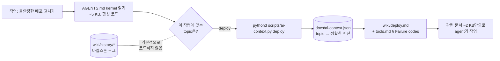
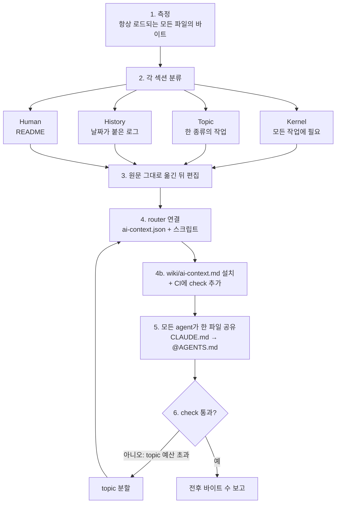
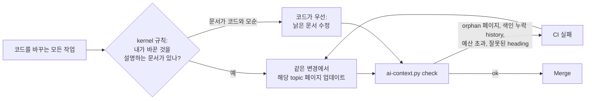

# agents-context-router

[English](README.md) | [日本語](README.ja.md) | **한국어** | [简体中文](README.zh-CN.md) | [繁體中文](README.zh-TW.md)

**`AGENTS.md`는 모든 작업에 붙는 세금입니다.** 이 skill은 그것을 5 KB짜리 kernel로 줄이고, 나머지는 작업에 필요할 때만 agent가 불러오게 합니다.

모든 코딩 agent(Claude Code, Codex, Cursor, Gemini CLI)는 무엇을 하든 먼저 루트 지침 파일부터 읽습니다. 프로젝트가 반년쯤 지나면 그 파일에는 마일스톤 로그, 도구 카탈로그, 배포 runbook, 디버깅 일지가 쌓이고, 정말 중요한 규칙 하나는 400번째 줄에 묻혀 있습니다. 한 줄짜리 오타 수정조차 이 모든 것의 비용을 context로, token으로, 그리고 주의력으로 치릅니다.

더 나쁜 건 정작 중요한 규칙이 묻혀 버린다는 점입니다. 14 KB짜리 `AGENTS.md`를 떠올려 보세요. *"shared 환경에서 절대 `make reset-db`를 실행하지 말 것"*이라는 유일한 언급이 2026-03 인수 테스트 로그 안에 들어 있고, 어떤 agent도 그 로그를 꼼꼼히 읽지 않습니다.

<p align="center">
  
</p>

```
Before                                  After
────────────────────────────────────    ─────────────────────────────────────────────
AGENTS.md    14 KB  every task          AGENTS.md              3–5 KB  every task
CLAUDE.md     3 KB  drifted copy        CLAUDE.md              @AGENTS.md (1 line)
README.md    85 KB  "read this first"   docs/ai-context.json   topic → exact sections
                                        scripts/ai-context.py  list | <topic> | check
                                        wiki/<topic>.md        loaded only when needed
                                        wiki/history/*.md      never loaded by default
```

이 skill은 실제 프로덕션 저장소에서 탄생했습니다. 85 KB짜리 README와 긴 `AGENTS.md`가 **5 KB kernel과 각 1.5–10 KB 크기의 topic 9개**로 바뀌었습니다. 그 뒤로 agent는 중요한 규칙을 건너뛰지 않게 되었습니다.

## 작업이 context를 불러오는 방식



kernel이 작기 때문에 agent는 그것을 꼼꼼히 읽습니다. 각 topic은 작업에 필요할 때만 로드되고, history는 누군가 요청하기 전까지 방해가 되지 않습니다.

<p align="center">
  
</p>

## 사용자 스토리

> **"Codex가 맨 위에 적힌 규칙을 자꾸 무시해요."** 한 1인 개발자의 `AGENTS.md`는 스프린트 노트와 make 타깃 표로 38 KB까지 불어나, 핵심 규칙이 소음 속에 묻혔습니다. skill은 이를 4 KB kernel로 줄이고 절대 규칙을 맨 위에 둡니다. 스프린트 노트는 `wiki/history/`로 옮기고, make 타깃은 `build` topic이 됩니다.

> **"Claude Code와 Codex가 포트 범위를 서로 다르게 알고 있어요."** 한 팀은 `CLAUDE.md`와 `AGENTS.md`를 각각 전체 사본으로 관리했고, 두 파일은 몇 달 전부터 어긋나 있었습니다. skill은 이를 하나의 `AGENTS.md`로 합칩니다. `CLAUDE.md`는 `@AGENTS.md`가 됩니다. 두 군데의 충돌은 사람이 결정하도록 표로 정리합니다. 조용히 한쪽을 골랐다가는 배포가 깨질 수 있기 때문입니다.

> **"뼈아프게 배운 교훈을 또 잊어버렸어요."** 장애 이후 누군가 2페이지짜리 post-mortem을 `AGENTS.md` 끝에 덧붙였습니다. skill은 교훈을 kernel 규칙 한 줄로 남기고("모든 벤더가 한꺼번에 실패하면 먼저 우리 네트워크를 의심할 것; `debugging` 로드"), 전체 기록은 원문 그대로 history로 옮깁니다.

> **"runbook 하나만 추가하고 싶어요."** 몇 달 뒤, 한 메인테이너가 retry-policy runbook을 추가합니다. skill은 이를 topic 페이지에 넣고, JSON에 매핑하고, kernel에는 표 한 줄만 추가합니다. `check`는 kernel이 2 KB가 아니라 89바이트만 늘었음을 확인해 줍니다.

> **"3개월 뒤에도 wiki가 여전히 맞을까요?"** 한 팀원이 재시도 로직을 바꾸고, kernel 규칙에 따라 같은 PR에서 `wiki/retry-policy.md`도 업데이트합니다. 다른 팀원은 `wiki/cache.md`를 추가했지만 매핑을 잊었습니다. 그 페이지가 모든 agent에게서 사라지기 전에, `check`가 CI에서 *"wiki page no topic loads"*로 실패합니다.

> **"CI에서 topic이 예산을 초과했대요."** `check`가 `deploy: 21003 B > 16384`로 실패합니다. skill은 상한을 올리지 않습니다. 대신 `deploy`를 `release`와 `rollback`으로 나눕니다. 그만큼 큰 topic은 사실 두 가지 작업이기 때문입니다.

## agent가 하는 일

*"우리 AGENTS.md가 너무 커, 나눠 줘"*라고 말하면 agent는 여섯 단계를 거칩니다.



1. 항상 로드되는 모든 것을 **측정**합니다.
2. 모든 섹션을 kernel, topic, history, human의 네 가지로 **분류**합니다. 기준은 이것입니다. *"이 줄이 없으면, 관계없는 작업에서 잘못된 행동이 일어날까?"*
3. 먼저 **원문 그대로 옮기고** 그다음에 편집하므로, 아무것도 조용히 사라지지 않습니다.
4. **router를 연결**합니다. 각 topic을 정확한 섹션에 매핑하는 JSON과 의존성 없는 스크립트입니다.
5. **모든 agent가 한 파일을 공유**하게 합니다. 어긋난 사본은 한 줄짜리 `@AGENTS.md` 포인터가 되고, 충돌은 조용히 해결하지 않고 여러분에게 보여 줍니다.
6. `check`로 **검증**하고 전후 바이트 수를 보고합니다.

그 뒤로 모든 작업은 이렇게 시작합니다.

```sh
$ python3 scripts/ai-context.py list
build-deploy       Repo layout, build and test commands, deploy procedure.
debugging          Something fails: triage order, logs, known failure codes.
cli-tools          tp-replay / tp-audit usage and flags.

$ python3 scripts/ai-context.py debugging     # prints ONLY what debugging needs
<!-- wiki/debugging.md -->
## Debugging
...
<!-- wiki/tools.md § Failure codes -->
### Failure codes
...
```

## 그냥 직접 파일을 나누면 안 되나요?

할 수는 있습니다. 하지만 한 달이면 원래대로 돌아갑니다. "내용을 `docs/`로 옮기기"에 더해 이 skill이 제공하는 것은 다음과 같습니다.

| 없을 때 | 있을 때 |
|---|---|
| agent가 "혹시 몰라서" `docs/*`를 전부 로드 | kernel이 지시: topic은 **하나**만 고르고, 경계를 넘을 때만 두 번째를 로드 |
| 줄 범위 참조가 편집할 때마다 깨짐 | **정확한 heading** 참조, heading이 바뀌거나 중복되면 **fail closed** |
| 셸 블록의 `# comment` 줄이 heading으로 파싱됨 | 파서가 fenced code 안의 heading을 무시 |
| kernel이 슬금슬금 20 KB로 되돌아감 | `check`가 **바이트 예산**(kernel 8 KB, topic당 16 KB)을 강제하고, 해결책은 상한 인상이 아니라 언제나 분할 |
| 어떤 agent도 모르는 새 topic | `AGENTS.md` 표에 없는 topic이 있으면 `check`가 실패 |
| `CLAUDE.md`와 `AGENTS.md`가 조용히 어긋남 | 소스는 하나, 다른 agent에게는 포인터 파일 |
| skill이 규칙을 다시 적다가 갈라짐 | skill은 "topic X를 로드하라"고만 말하는 어댑터가 됨 |
| history 로그 속에 숨은 규칙 | 분류 단계에서 kernel로 끌어올림 |
| 리팩터링 한 달 뒤 문서가 썩음 | **스스로 유지**: 같은 변경에서 낡은 문서를 고치는 kernel 규칙, 저장소 내 매뉴얼, CI의 orphan 검사 |

[`references/gotchas.md`](skills/agents-context-router/references/gotchas.md)도 함께 제공합니다. 실제 분할 과정에서 마주친 함정 21가지와 각각이 왜 문제가 되는지 정리했습니다. 이 파일 하나만으로도 star를 누를 가치가 있습니다.

## 실제로 도움이 되나요?

같은 모델로, skill이 있을 때와 없을 때 현실적인 작업 세 가지를 실행했습니다.
- 14 KB `AGENTS.md` 분할하기
- 어긋난 `CLAUDE.md` 통합하기
- 이미 라우팅된 저장소에 runbook 추가하기

모든 결과물은 스크립트 기반 check로 채점했습니다.

| | skill 사용 | 미사용 |
|---|---|---|
| 통과한 check | **33 / 33 (100%)** | 21 / 33 (64%) |

baseline이 놓친 것들:
- 항상 로드되는 파일에 휘발성 상태("41/120 done")를 남겨 두었습니다.
- deploy skill이 규칙의 자체 사본을 계속 갖고 있게 두었습니다.
- topic을 로드하거나 예산을 강제할 수단을 전혀 제공하지 않았습니다.
- 마일스톤 로그를 원문 그대로 옮기지 않고 다시 썼습니다.
- 자기 유지 장치를 하나도 설치하지 않았습니다. 문서를 사실대로 유지하는 규칙도, 저장소 내 매뉴얼도, orphan 검사도 없었습니다.

도중에 regression을 하나 잡았습니다. 초기 버전에서 오래된 로그 속에 숨은 규칙("shared 환경에서 절대 `make reset-db`를 실행하지 말 것")이 그대로 history로 넘어가 버린 적이 있습니다. 이제 skill은 로그를 옮기기 전에 살아 있는 규칙이 있는지 모든 로그를 grep하고, 재실행은 통과했습니다.

skill을 쓰면 실행당 약 25초와 6k token이 더 듭니다. 표본은 작습니다(버전별·작업별 n = 1회 실행). 프롬프트는 [`evals/`](skills/agents-context-router/evals/)에 있으니, 결과를 재현하고 PR을 보내 주세요.

## 빠른 시작

### plugin으로 설치

#### Claude Code

```text
/plugin marketplace add runkids/agents-context-router
/plugin install agents-context-router@agents-context-router
```

#### Codex

```bash
codex plugin marketplace add runkids/agents-context-router
codex
```

Codex에서 `/plugins`를 열고 **agents-context-router**를 찾아 설치하세요. 사용하려면 새 세션을 시작하세요.

#### [Skillshare](https://github.com/runkids/skillshare) 사용

이미 Skillshare를 사용 중이라면 명령 하나로 Claude Code와 Codex에 이 native plugin을 설치하고, 에이전트별 설치 상태와 설정을 관리할 수 있습니다.

```bash
skillshare plugin add runkids/agents-context-router --plugin agents-context-router --target claude --target codex --global
skillshare sync plugins
```

[여러 코딩 에이전트를 지원하는 Skillshare](https://skillshare.runkids.cc/docs/reference/commands/plugin/)로 plugin 관리도 한곳에 모아 보세요.

### [Skillshare](https://github.com/runkids/skillshare)로 skill 설치

```bash
# global: every project on this machine
skillshare install runkids/agents-context-router
skillshare sync

# project only: installs into ./.skillshare/skills
skillshare install runkids/agents-context-router -p
skillshare sync -p
```

### [Vercel Skills CLI](https://github.com/vercel-labs/skills) 사용

```bash
# project (default): installs for the agents detected in this repo
npx skills add runkids/agents-context-router

# global, for every agent
npx skills add runkids/agents-context-router -g -a '*'
```

### 수동 설치

```bash
git clone https://github.com/runkids/agents-context-router
cp -r agents-context-router/skills/agents-context-router ~/.claude/skills/   # Claude Code
cp -r agents-context-router/skills/agents-context-router ~/.codex/skills/    # Codex
```

그런 다음 아무 저장소에서나:

> **"우리 AGENTS.md가 너무 커. kernel과 wiki topic으로 나눠 줘."**

다른 표현으로도 동작합니다. "CLAUDE.md와 AGENTS.md가 어긋났어", "세션마다 마일스톤 history를 로드하지 마", "AGENTS.md를 키우지 말고 이 runbook을 추가해 줘" 같은 말도 괜찮습니다.

## 30초 만에 보는 router

`docs/ai-context.json`이 유일한 기준 정보(single source of truth)입니다.

```json
{
  "budgets": { "rootInstructionsMaxBytes": 8192, "defaultTopicMaxBytes": 16384 },
  "topics": {
    "debugging": {
      "description": "Something fails: triage order, logs, known failure codes.",
      "sources": [
        { "path": "wiki/debugging.md" },
        { "path": "wiki/tools.md", "heading": "Failure codes" }
      ]
    }
  }
}
```

source는 파일 전체이거나 정확한 heading 하나입니다. 섹션은 같은 레벨 이상의 다음 heading 직전까지입니다. 출력되는 각 섹션에는 `<!-- path § heading -->` 마커가 붙으므로, agent는 렌더링된 사본이 아니라 원본을 편집합니다.

`scripts/ai-context.py`는 의존성 없는 표준 라이브러리 Python 파일 하나입니다. `check`를 CI에 넣으세요.

```sh
$ python3 scripts/ai-context.py check
AGENTS.md            3095 B  (cap 8192)
build-test            512 B  (cap 16384)
deploy                556 B  (cap 16384)
debugging            1249 B  (cap 16384)
ok
```

## 스스로 유지됩니다

대부분의 문서 리팩터링은 시간이 지나면 무너집니다. 코드는 계속 바뀌는데 아무도 페이지를 업데이트하지 않으니까요. 여기서는 유지 장치가 **여러분의 저장소 안에** 있으므로, skill을 제거한 뒤에도, 그리고 skill을 가져 본 적 없는 agent에게도 계속 동작합니다.



네 가지 요소로 구성됩니다.
- **kernel 규칙 "문서를 사실대로 유지할 것".** 모든 agent가 모든 작업에서 이 규칙을 로드합니다. topic이 설명하는 동작을 바꾸면 같은 변경에서 그 페이지를 업데이트하고, 문서가 코드와 모순되면 코드가 우선이며 문서를 고칩니다.
- **`wiki/ai-context.md`.** topic을 추가·이동·분할하는 방법을 담은 저장소 내 매뉴얼입니다. 어떤 agent든 `ai-context.py ai-context`로 로드할 수 있습니다.
- **orphan 검사.** 어떤 topic도 로드하지 않는 wiki 페이지가 있거나, history 파일이 색인에서 빠졌거나, 중첩된 `AGENTS.md`를 어떤 topic도 로드하지 않으면 `check`가 실패합니다.
- **CI 연결.** skill이 기존 `test`, Makefile, pre-commit 또는 GitHub Actions job에 `check`를 추가합니다.

## 구성 요소

| 경로 | 내용 |
|---|---|
| [`SKILL.md`](skills/agents-context-router/SKILL.md) | 워크플로: 측정 → 분류 → 이동 → 연결 → 검증 → 보고 |
| [`references/gotchas.md`](skills/agents-context-router/references/gotchas.md) | 함정 21가지와 각각이 중요한 이유 |
| [`scripts/ai-context.py`](skills/agents-context-router/scripts/ai-context.py) | router: `list`, `<topic>`, `check` |
| [`assets/`](skills/agents-context-router/assets/) | 템플릿: kernel `AGENTS.md`, `ai-context.json`, `wiki/README.md`, 그리고 저장소 내 유지 관리 매뉴얼 `wiki/ai-context.md` |
| [`evals/`](skills/agents-context-router/evals/) | 작업 eval(`evals.json`)과 트리거 eval(`trigger-evals.json`) |

## FAQ

**Cursor, Gemini CLI, Aider 등에서도 동작하나요?** 네. router는 평범한 markdown과 스크립트 하나로 이루어져 있어서, `python3`를 실행할 수 있는 agent라면 무엇이든 사용할 수 있습니다. skill은 네이티브 `AGENTS.md` 지원 여부를 짐작하지 말고 각 도구의 최신 문서를 확인하라고 agent에게 지시합니다.

**agent가 topic 로드를 건너뛰지 않을까요?** kernel은 중요한 topic마다 한 줄짜리 트리거를 둡니다("매번 같은 방식으로 실패하면 먼저 우리 코드를 의심할 것; `debugging` 로드"). 트리거는 항상 로드되고, runbook은 그렇지 않습니다.

**분할한 뒤 wiki는 누가 최신으로 유지하나요?** 모든 agent가 모든 작업에서 합니다. kernel 규칙이 변경의 영향을 받는 topic을 업데이트하라고 지시하고, orphan이나 깨진 heading이 있으면 CI가 실패합니다. [스스로 유지됩니다](#스스로-유지됩니다)를 참고하세요.

**history와 마일스톤 로그는 어떻게 되나요?** 원래 언어 그대로 `wiki/history/`로 원문 그대로 옮겨집니다. 요약으로 사라지는 내용은 없으며, skill은 전후 총 바이트 수를 비교해 이를 증명합니다.

**사람이 읽기 좋은 문서도 유지할 수 있나요?** 네. `README.md`는 사람을 위해 남겨 두고(소개, 빠른 시작, 문서 지도), `wiki/README.md`는 JSON을 그대로 반영한 사람용 router 표가 됩니다.

## 라이선스

MIT
