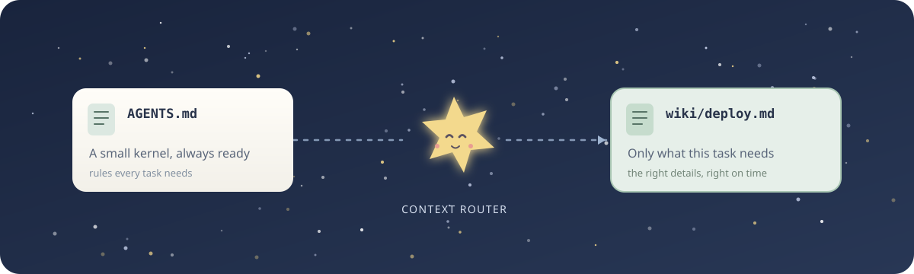
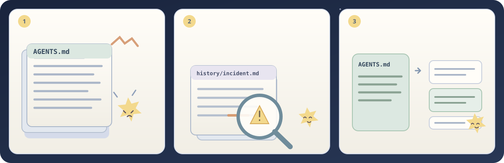
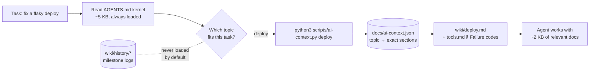
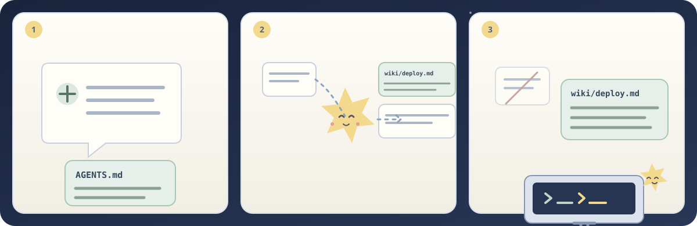
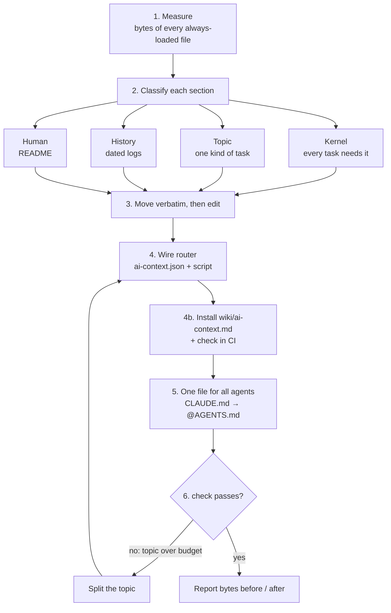
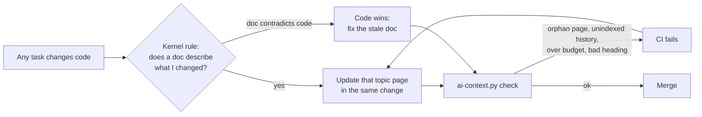

# agents-context-router

**English** | [日本語](README.ja.md) | [한국어](README.ko.md) | [简体中文](README.zh-CN.md) | [繁體中文](README.zh-TW.md)

**Your `AGENTS.md` is a tax on every task.** This skill cuts it down to a 5 KB kernel, and your agent loads the rest only when the task needs it.

Every coding agent (Claude Code, Codex, Cursor, Gemini CLI) reads your root instruction file before it does anything. Six months into a project that file holds milestone logs, tool catalogs, deploy runbooks, a debugging diary and one critical rule buried on line 400. A one-line typo fix pays for all of it in context, in tokens and in attention.

<p align="center">
  
</p>

Worse, the rule that matters gets lost. Picture a 14 KB `AGENTS.md` where the only mention of *"never run `make reset-db` on shared"* sits inside a 2026-03 acceptance log that no agent will ever read carefully.

<p align="center">
  
</p>

```
Before                                  After
────────────────────────────────────    ─────────────────────────────────────────────
AGENTS.md    14 KB  every task          AGENTS.md              3–5 KB  every task
CLAUDE.md     3 KB  drifted copy        CLAUDE.md              @AGENTS.md (1 line)
README.md    85 KB  "read this first"   docs/ai-context.json   topic → exact sections
                                        scripts/ai-context.py  list | <topic> | check
                                        wiki/<topic>.md        loaded only when needed
                                        wiki/history/*.md      never loaded by default
```

This came out of a real production repo: an 85 KB README plus a long `AGENTS.md` became a **5 KB kernel with 9 topics of 1.5–10 KB each**. Agents stopped skimming past the rules that mattered.

## How a task loads context



The kernel stays small, so the agent reads it carefully. Each topic loads only when the task needs it, and history stays out of the way until someone asks for it.

<p align="center">
  
</p>

## User stories

> **"Codex keeps ignoring the rules at the top."** A solo developer's `AGENTS.md` has grown to 38 KB of sprint notes and make-target tables, so the critical rules are lost in the noise. The skill cuts it to a 4 KB kernel with the hard limits at the top. Sprint notes move to `wiki/history/`, and the make targets become a `build` topic.

> **"Claude Code and Codex disagree about our port range."** A team keeps `CLAUDE.md` and `AGENTS.md` as full copies that drifted months ago. The skill merges them into one `AGENTS.md`. `CLAUDE.md` becomes `@AGENTS.md`. The two conflicts go into a table for a human to decide, because picking one quietly could break a deploy.

> **"We learned that lesson the hard way, then forgot it."** After an incident, someone appended a 2-page post-mortem to `AGENTS.md`. The skill keeps the lesson as one kernel rule ("when every vendor fails at once, suspect our network first; load `debugging`") and moves the full write-up to history, verbatim.

> **"I just need to add one runbook."** Months later, a maintainer adds a retry-policy runbook. The skill puts it in a topic page, maps it in the JSON and adds one table row to the kernel. `check` confirms the kernel grew by 89 bytes, not 2 KB.

> **"Three months later, is the wiki still true?"** A teammate changes the retry logic and, per the kernel rule, updates `wiki/retry-policy.md` in the same PR. Another adds `wiki/cache.md` but forgets to map it. `check` fails in CI with *"wiki page no topic loads"* before the page becomes invisible to every agent.

> **"CI says a topic is over budget."** `check` fails with `deploy: 21003 B > 16384`. The skill does not raise the cap. It splits `deploy` into `release` and `rollback`, because a topic that big is really two tasks.

## What your agent does with it

Say *"our AGENTS.md is too big, split it"* and the agent works through six steps:



1. **Measures** everything that is always loaded.
2. **Classifies** every section into one of four buckets: kernel, topic, history or human. The test is: *"would a wrong action happen on an unrelated task without this line?"*
3. **Moves text verbatim** first, then edits, so nothing silently disappears.
4. **Wires a router**: a JSON map from each topic to exact sections, plus a zero-dependency script.
5. **Makes every agent share one file**: drifted copies become a one-line `@AGENTS.md` pointer, and conflicts are shown to you rather than resolved in silence.
6. **Verifies** with `check` and reports byte counts before and after.

Then every future task starts like this:

```sh
$ python3 scripts/ai-context.py list
build-deploy       Repo layout, build and test commands, deploy procedure.
debugging          Something fails: triage order, logs, known failure codes.
cli-tools          tp-replay / tp-audit usage and flags.

$ python3 scripts/ai-context.py debugging     # prints ONLY what debugging needs
<!-- wiki/debugging.md -->
## Debugging
...
<!-- wiki/tools.md § Failure codes -->
### Failure codes
...
```

## Why not just split the files yourself?

You can, and it drifts back within a month. Here is what the skill adds on top of "move stuff into `docs/`":

| Without | With |
|---|---|
| Agents load `docs/*` "to be safe" | The kernel says: pick **one** topic, and load a second only across seams |
| Line-range references break on every edit | **Exact-heading** references that **fail closed** when a heading is renamed or duplicated |
| `# comment` lines in shell blocks are parsed as headings | The parser ignores headings inside fenced code |
| The kernel creeps back to 20 KB | `check` enforces **byte budgets** (8 KB kernel, 16 KB per topic), and the fix is to split, never to raise the cap |
| A new topic that no agent knows about | `check` fails when a topic is missing from the `AGENTS.md` table |
| `CLAUDE.md` and `AGENTS.md` quietly disagree | One source; the other agent gets a pointer file |
| Skills restate the rules and fork them | Skills become adapters that say "load topic X" |
| Rules hidden in history logs | The classification pass pulls them into the kernel |
| Docs rot a month after the refactor | **Self-maintaining**: a kernel rule to fix stale docs in the same change, an in-repo manual, and orphan checks in CI |

It also ships [`references/gotchas.md`](skills/agents-context-router/references/gotchas.md): 21 traps from a real split, each with the reason it bites. That file alone is worth the star.

## Does it actually help?

We ran three realistic tasks with and without the skill, on the same model:
- split a 14 KB `AGENTS.md`;
- consolidate a drifted `CLAUDE.md`;
- add a runbook to an already-routed repo.

Scripted checks graded every output.

| | With skill | Without |
|---|---|---|
| Checks passed | **33 / 33 (100%)** | 21 / 33 (64%) |

What the baseline missed:
- It left volatile status ("41/120 done") in the always-loaded file.
- It left the deploy skill with its own copy of the rules.
- It shipped no way to load a topic or to enforce a budget.
- It rewrote a milestone log instead of moving it verbatim.
- It installed no self-maintenance at all: no keep-docs-true rule, no in-repo manual and no orphan check.

One regression was caught on the way. An early revision once let a rule hidden in an old log ("never run `make reset-db` on shared") slip into history. The skill now greps every log for live rules before moving it, and the rerun passed.

The skill costs about 25 s and 6k tokens more per run. The sample is small (n = 1 run per task per revision). The prompts are in [`evals/`](skills/agents-context-router/evals/), so reproduce the results and send a PR.

## Quick start

### Install as a plugin

#### Claude Code

```text
/plugin marketplace add runkids/agents-context-router
/plugin install agents-context-router@agents-context-router
```

#### Codex

```bash
codex plugin marketplace add runkids/agents-context-router
codex
```

Then open `/plugins`, find **agents-context-router**, and install it. Start a new session to use the skill.

#### With [Skillshare](https://github.com/runkids/skillshare)

Already using Skillshare? It can install this native plugin for Claude Code and Codex from one command, with per-agent install status and controls:

```bash
skillshare plugin add runkids/agents-context-router --plugin agents-context-router --target claude --target codex --global
skillshare sync plugins
```

Skillshare also manages complete native plugins across [multiple coding agents](https://skillshare.runkids.cc/docs/reference/commands/plugin/), so you can keep your plugin setup in one place.

### Install as a skill with [Skillshare](https://github.com/runkids/skillshare)

```bash
# global: every project on this machine
skillshare install runkids/agents-context-router
skillshare sync

# project only: installs into ./.skillshare/skills
skillshare install runkids/agents-context-router -p
skillshare sync -p
```

### With [Vercel Skills CLI](https://github.com/vercel-labs/skills)

```bash
# project (default): installs for the agents detected in this repo
npx skills add runkids/agents-context-router

# global, for every agent
npx skills add runkids/agents-context-router -g -a '*'
```

### Manual

```bash
git clone https://github.com/runkids/agents-context-router
cp -r agents-context-router/skills/agents-context-router ~/.claude/skills/   # Claude Code
cp -r agents-context-router/skills/agents-context-router ~/.codex/skills/    # Codex
```

Then, in any repo:

> **"Our AGENTS.md is too big. Split it into a kernel and wiki topics."**

Other phrasings trigger it too: "CLAUDE.md and AGENTS.md drifted", "stop loading the milestone history every session", or "add this runbook without making AGENTS.md fatter".

## The router in 30 seconds

`docs/ai-context.json` is the single source of truth:

```json
{
  "budgets": { "rootInstructionsMaxBytes": 8192, "defaultTopicMaxBytes": 16384 },
  "topics": {
    "debugging": {
      "description": "Something fails: triage order, logs, known failure codes.",
      "sources": [
        { "path": "wiki/debugging.md" },
        { "path": "wiki/tools.md", "heading": "Failure codes" }
      ]
    }
  }
}
```

A source is a whole file or one exact heading. A section runs to the next heading of the same or higher level. Each printed section carries a `<!-- path § heading -->` marker, so the agent edits the source rather than the rendered copy.

`scripts/ai-context.py` is one stdlib Python file with no dependencies. Put `check` in CI:

```sh
$ python3 scripts/ai-context.py check
AGENTS.md            3095 B  (cap 8192)
build-test            512 B  (cap 16384)
deploy                556 B  (cap 16384)
debugging            1249 B  (cap 16384)
ok
```

## It maintains itself

Most doc refactors decay: the code moves on, and nobody updates the page. Here the upkeep lives **in your repo**, so it keeps working after the skill is uninstalled and for agents that never had it:



It has four parts:
- **The kernel rule "Keep the docs true".** Every agent loads it on every task: when you change behaviour a topic describes, update that page in the same change, and when a doc contradicts the code, the code wins and you fix the doc.
- **`wiki/ai-context.md`.** An in-repo manual for adding, moving and splitting topics. Any agent can load it with `ai-context.py ai-context`.
- **Orphan checks.** `check` fails when a wiki page is loaded by no topic, when a history file is missing from the index, or when a nested `AGENTS.md` is loaded by no topic.
- **CI wiring.** The skill adds `check` to your existing `test`, Makefile, pre-commit or GitHub Actions job.

## What's inside

| Path | What |
|---|---|
| [`SKILL.md`](skills/agents-context-router/SKILL.md) | The workflow: measure → classify → move → wire → verify → report |
| [`references/gotchas.md`](skills/agents-context-router/references/gotchas.md) | 21 traps and why each matters |
| [`scripts/ai-context.py`](skills/agents-context-router/scripts/ai-context.py) | The router: `list`, `<topic>`, `check` |
| [`assets/`](skills/agents-context-router/assets/) | Templates: kernel `AGENTS.md`, `ai-context.json`, `wiki/README.md` and the in-repo maintenance manual `wiki/ai-context.md` |
| [`evals/`](skills/agents-context-router/evals/) | Task evals (`evals.json`) and trigger evals (`trigger-evals.json`) |

## FAQ

**Does this work with Cursor, Gemini CLI, Aider and others?** Yes. The router is plain markdown plus a script, and any agent that can run `python3` can use it. The skill tells the agent to check each tool's current docs for native `AGENTS.md` support rather than assume.

**Won't agents skip loading the topic?** The kernel keeps a one-line trigger for each topic that matters ("if every run fails the same way, suspect our code first; load `debugging`"). The trigger is always loaded; the runbook is not.

**Who keeps the wiki up to date after the split?** Every agent does, on every task. The kernel rule tells it to update the topic its change affects, and CI fails on orphans or broken headings. See [It maintains itself](#it-maintains-itself).

**What about my history and milestone logs?** They move verbatim to `wiki/history/`, in their original language. Nothing is summarized away, and the skill compares total bytes before and after to prove it.

**Can I keep human-friendly docs?** Yes. `README.md` stays for people (intro, quickstart, doc map), and `wiki/README.md` is a human router table that mirrors the JSON.

## License

MIT
