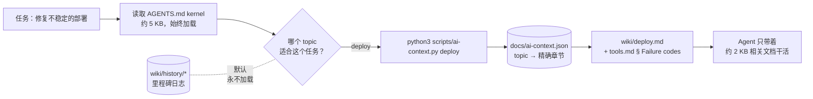
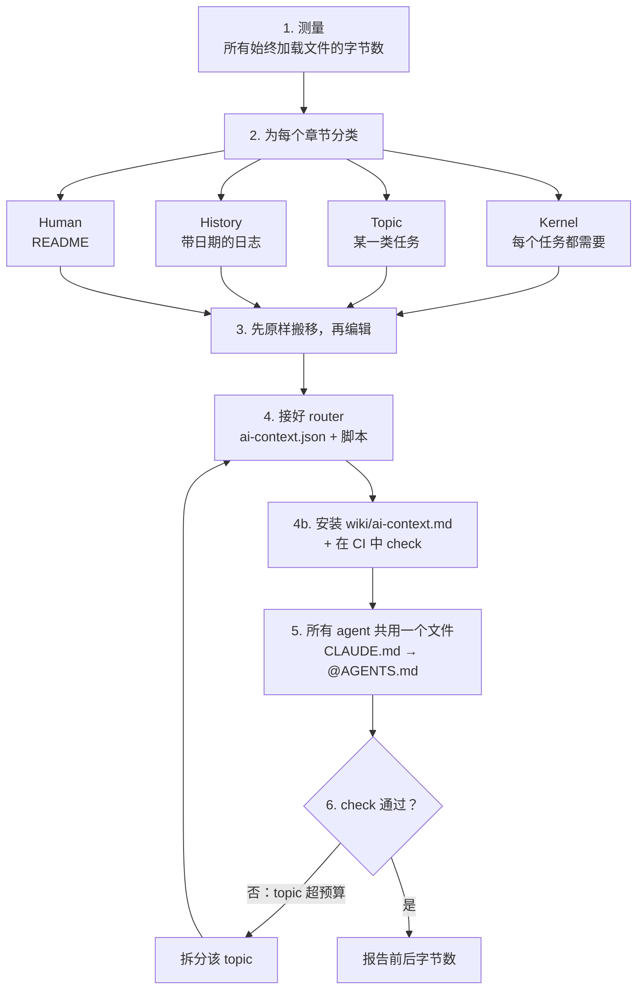
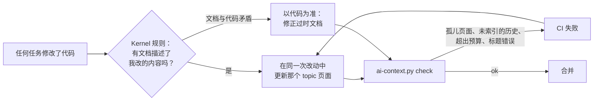

# agents-context-router

[English](README.md) | [日本語](README.ja.md) | [한국어](README.ko.md) | **简体中文** | [繁體中文](README.zh-TW.md)

**你的 `AGENTS.md` 正在给每个任务“收税”。** 这个 skill 把它压缩成一个 5 KB 的 kernel，其余内容只在任务真正需要时才由 agent 加载。

每个 coding agent（Claude Code、Codex、Cursor、Gemini CLI）在动手之前都会先读根目录的指令文件。项目做了半年，这个文件里塞满了里程碑日志、工具清单、部署 runbook、调试日记，还有一条关键规则埋在第 400 行。哪怕只是修一个单行错别字，也要为这一切买单：占用上下文、消耗 token、分散注意力。

更糟的是，真正重要的规则会被淹没。想象一个 14 KB 的 `AGENTS.md`，其中唯一一处提到 *“永远不要在 shared 上运行 `make reset-db`”* 的地方，藏在一份 2026-03 的验收日志里，而没有任何 agent 会认真读它。

```
Before                                  After
────────────────────────────────────    ─────────────────────────────────────────────
AGENTS.md    14 KB  every task          AGENTS.md              3–5 KB  every task
CLAUDE.md     3 KB  drifted copy        CLAUDE.md              @AGENTS.md (1 line)
README.md    85 KB  "read this first"   docs/ai-context.json   topic → exact sections
                                        scripts/ai-context.py  list | <topic> | check
                                        wiki/<topic>.md        loaded only when needed
                                        wiki/history/*.md      never loaded by default
```

它诞生于一个真实的生产仓库：85 KB 的 README 加上一份冗长的 `AGENTS.md`，最终变成了 **一个 5 KB 的 kernel，外加 9 个 topic，每个 1.5–10 KB**。从此 agent 不再跳过那些真正重要的规则。

## 一个任务如何加载上下文



kernel 保持精简，agent 才会认真读它。每个 topic 只在任务需要时加载，历史记录则安静待在一旁，直到有人主动要它。

## 用户故事

> **“Codex 总是无视顶部的规则。”** 一位独立开发者的 `AGENTS.md` 膨胀到了 38 KB，全是 sprint 笔记和 make target 表格，关键规则被噪音淹没。这个 skill 把它砍成 4 KB 的 kernel，硬性限制放在最顶部。sprint 笔记移到 `wiki/history/`，make target 变成一个 `build` topic。

> **“Claude Code 和 Codex 对我们的端口范围意见不一。”** 一个团队把 `CLAUDE.md` 和 `AGENTS.md` 维护成两份完整副本，几个月前就已经各自漂移。这个 skill 把它们合并成一个 `AGENTS.md`，`CLAUDE.md` 变成 `@AGENTS.md`。两处冲突整理成表格交给人来决定，因为悄悄选一个可能会搞坏部署。

> **“这个教训我们付出过代价，然后又忘了。”** 一次事故之后，有人往 `AGENTS.md` 末尾追加了两页事后复盘。这个 skill 把教训保留为一条 kernel 规则（“当所有供应商同时出故障时，先怀疑我们自己的网络；加载 `debugging`”），完整的复盘原文一字不改地移入历史记录。

> **“我只是想加一份 runbook。”** 几个月后，一位维护者要加一份重试策略 runbook。这个 skill 把它放进 topic 页面，在 JSON 里建立映射，并在 kernel 里只加一行表格。`check` 确认 kernel 只增加了 89 字节，而不是 2 KB。

> **“三个月后，wiki 还靠谱吗？”** 一位同事修改了重试逻辑，按照 kernel 规则，在同一个 PR 里更新了 `wiki/retry-policy.md`。另一位新增了 `wiki/cache.md`，却忘了做映射。`check` 在 CI 里报错 *“wiki page no topic loads”*，赶在这个页面对所有 agent 都“隐身”之前拦住了它。

> **“CI 说某个 topic 超预算了。”** `check` 报错 `deploy: 21003 B > 16384`。这个 skill 不会调高上限，而是把 `deploy` 拆成 `release` 和 `rollback`，因为这么大的 topic 其实是两个任务。

## 你的 agent 会怎么用它

只要说一句 *“我们的 AGENTS.md 太大了，拆一下”*，agent 就会按六个步骤完成：



1. **测量**所有始终加载的内容。
2. **分类**：把每个章节归入四类之一：kernel、topic、history 或 human。判断标准是：*“如果没有这一行，在一个无关的任务上会不会做出错误操作？”*
3. **先原样搬移文本**，再做编辑，确保没有任何内容悄悄消失。
4. **接好 router**：一个把每个 topic 映射到精确章节的 JSON，外加一个零依赖脚本。
5. **让所有 agent 共用一个文件**：漂移的副本变成一行 `@AGENTS.md` 指针，冲突会摆到你面前，而不是被悄悄解决。
6. **用 `check` 验证**，并报告前后的字节数。

从此以后，每个任务都这样开始：

```sh
$ python3 scripts/ai-context.py list
build-deploy       Repo layout, build and test commands, deploy procedure.
debugging          Something fails: triage order, logs, known failure codes.
cli-tools          tp-replay / tp-audit usage and flags.

$ python3 scripts/ai-context.py debugging     # prints ONLY what debugging needs
<!-- wiki/debugging.md -->
## Debugging
...
<!-- wiki/tools.md § Failure codes -->
### Failure codes
...
```

## 为什么不自己拆文件？

当然可以，但一个月内它就会慢慢变回原样。相比“把东西挪进 `docs/`”，这个 skill 多做了这些：

| 没有它 | 有了它 |
|---|---|
| Agent 为了“保险起见”把 `docs/*` 全部加载 | kernel 明确要求：只选 **一个** topic，只有跨越边界时才加载第二个 |
| 行号范围引用每次编辑都会失效 | 使用**精确标题**引用，标题被改名或重复时会 **fail closed**（直接报错） |
| shell 代码块里的 `# comment` 行被当成标题解析 | 解析器会忽略 fenced code 里的标题 |
| kernel 又慢慢涨回 20 KB | `check` 强制执行**字节预算**（kernel 8 KB，每个 topic 16 KB），超了就拆，绝不调高上限 |
| 新增的 topic 没有任何 agent 知道 | topic 没出现在 `AGENTS.md` 表格里时，`check` 直接失败 |
| `CLAUDE.md` 和 `AGENTS.md` 悄悄出现分歧 | 只有一个来源，另一个 agent 拿到的是指针文件 |
| Skill 重复抄写规则，然后各自分叉 | Skill 变成只说“加载 topic X”的适配层 |
| 规则藏在历史日志里 | 分类环节会把它们提取到 kernel |
| 重构一个月后文档就开始腐烂 | **自我维护**：一条“在同一次改动里修正过时文档”的 kernel 规则、一份仓库内手册，以及 CI 中的孤儿检查 |

它还附带了 [`references/gotchas.md`](skills/agents-context-router/references/gotchas.md)：来自一次真实拆分的 21 个坑，每个都写明了为什么会踩。光这一个文件就值一个 star。

## 真的有用吗？

我们在同一个模型上，分别在有 skill 和没有 skill 的情况下跑了三个真实任务：
- 拆分一个 14 KB 的 `AGENTS.md`；
- 整合一份已漂移的 `CLAUDE.md`；
- 给一个已经接好 router 的仓库新增一份 runbook。

每个输出都由脚本化检查评分。

| | 有 skill | 没有 |
|---|---|---|
| 通过的检查 | **33 / 33 (100%)** | 21 / 33 (64%) |

基线版本漏掉了什么：
- 把易变的状态（“41/120 done”）留在了始终加载的文件里。
- 让 deploy skill 保留了一份自己的规则副本。
- 没有提供任何加载 topic 或强制执行预算的方式。
- 重写了一份里程碑日志，而不是原样搬移。
- 完全没有安装自我维护机制：没有“保持文档真实”规则，没有仓库内手册，也没有孤儿检查。

过程中还抓到了一次回归。早期某个版本曾让一条藏在旧日志里的规则（“永远不要在 shared 上运行 `make reset-db`”）被一起移进了历史记录。现在这个 skill 在搬移每份日志之前都会先 grep 出仍然有效的规则，重跑后顺利通过。

每次运行，这个 skill 大约多花 25 秒和 6k token。样本量很小（每个版本每个任务 n = 1 次运行）。提示词都在 [`evals/`](skills/agents-context-router/evals/) 里，欢迎复现结果并提交 PR。

## 快速开始

### 使用 [skillshare](https://github.com/runkids/skillshare)

```bash
# global: every project on this machine
skillshare install runkids/agents-context-router
skillshare sync

# project only: installs into ./.skillshare/skills
skillshare install runkids/agents-context-router -p
skillshare sync -p
```

### 使用 [Vercel Skills CLI](https://github.com/vercel-labs/skills)

```bash
# project (default): installs for the agents detected in this repo
npx skills add runkids/agents-context-router

# global, for every agent
npx skills add runkids/agents-context-router -g -a '*'
```

### 手动安装

```bash
git clone https://github.com/runkids/agents-context-router
cp -r agents-context-router/skills/agents-context-router ~/.claude/skills/   # Claude Code
cp -r agents-context-router/skills/agents-context-router ~/.codex/skills/    # Codex
```

然后，在任意仓库里说：

> **“我们的 AGENTS.md 太大了。把它拆成一个 kernel 和若干 wiki topic。”**

其他说法也能触发它，比如：“CLAUDE.md 和 AGENTS.md 已经不一致了”、“别再每次会话都加载里程碑历史了”，或者“加上这份 runbook，但别让 AGENTS.md 变胖”。

## 30 秒看懂 router

`docs/ai-context.json` 是唯一的事实来源：

```json
{
  "budgets": { "rootInstructionsMaxBytes": 8192, "defaultTopicMaxBytes": 16384 },
  "topics": {
    "debugging": {
      "description": "Something fails: triage order, logs, known failure codes.",
      "sources": [
        { "path": "wiki/debugging.md" },
        { "path": "wiki/tools.md", "heading": "Failure codes" }
      ]
    }
  }
}
```

一个 source 可以是整个文件，也可以是某个精确标题。一个章节会一直延续到下一个同级或更高级的标题为止。每个输出的章节都带有 `<!-- path § heading -->` 标记，这样 agent 修改的是源文件，而不是渲染出来的副本。

`scripts/ai-context.py` 是一个只用标准库、零依赖的 Python 文件。把 `check` 放进 CI：

```sh
$ python3 scripts/ai-context.py check
AGENTS.md            3095 B  (cap 8192)
build-test            512 B  (cap 16384)
deploy                556 B  (cap 16384)
debugging            1249 B  (cap 16384)
ok
```

## 它能自我维护

大多数文档重构都会逐渐腐烂：代码往前走了，却没人更新页面。而这里的维护机制就**住在你的仓库里**，所以即使卸载了这个 skill，或者换成从没装过它的 agent，它也照样有效：



它由四部分组成：
- **kernel 规则“保持文档真实”（Keep the docs true）。** 每个 agent 在每个任务中都会加载它：当你修改了某个 topic 所描述的行为时，在同一次改动里更新那个页面；当文档与代码矛盾时，以代码为准，并修正文档。
- **`wiki/ai-context.md`。** 一份仓库内手册，讲解如何新增、移动和拆分 topic。任何 agent 都可以用 `ai-context.py ai-context` 加载它。
- **孤儿检查。** 当某个 wiki 页面没有被任何 topic 加载、某个历史文件没有出现在索引中，或某个嵌套的 `AGENTS.md` 没有被任何 topic 加载时，`check` 都会失败。
- **CI 接入。** 这个 skill 会把 `check` 加进你现有的 `test`、Makefile、pre-commit 或 GitHub Actions job。

## 里面有什么

| 路径 | 内容 |
|---|---|
| [`SKILL.md`](skills/agents-context-router/SKILL.md) | 工作流程：测量 → 分类 → 搬移 → 接线 → 验证 → 报告 |
| [`references/gotchas.md`](skills/agents-context-router/references/gotchas.md) | 21 个坑，以及每个坑为什么重要 |
| [`scripts/ai-context.py`](skills/agents-context-router/scripts/ai-context.py) | router 本体：`list`、`<topic>`、`check` |
| [`assets/`](skills/agents-context-router/assets/) | 模板：kernel `AGENTS.md`、`ai-context.json`、`wiki/README.md`，以及仓库内维护手册 `wiki/ai-context.md` |
| [`evals/`](skills/agents-context-router/evals/) | 任务评测（`evals.json`）和触发评测（`trigger-evals.json`） |

## FAQ

**它能用于 Cursor、Gemini CLI、Aider 等工具吗？** 可以。router 就是普通的 markdown 加一个脚本，任何能运行 `python3` 的 agent 都能用。这个 skill 会让 agent 去查阅各个工具的最新文档，确认是否原生支持 `AGENTS.md`，而不是想当然。

**agent 会不会干脆不加载 topic？** kernel 为每个重要的 topic 保留了一行触发语句（“如果每次运行都以同样的方式失败，先怀疑我们自己的代码；加载 `debugging`”）。触发语句始终加载，runbook 则不会。

**拆分之后谁来维护 wiki？** 每个 agent，在每个任务中。kernel 规则会让它更新自己改动所影响的 topic，而 CI 会在出现孤儿页面或失效标题时失败。详见[它能自我维护](#它能自我维护)。

**我的历史记录和里程碑日志怎么办？** 它们会以原始语言、一字不改地移到 `wiki/history/`。没有任何内容被“总结”掉，skill 还会比较前后总字节数来证明这一点。

**我还能保留给人看的文档吗？** 可以。`README.md` 继续留给人看（简介、快速开始、文档地图），而 `wiki/README.md` 是一张给人看的 router 表格，与 JSON 保持一致。

## 许可证

MIT
