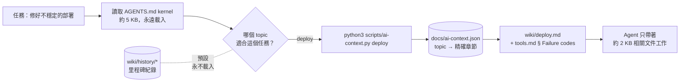
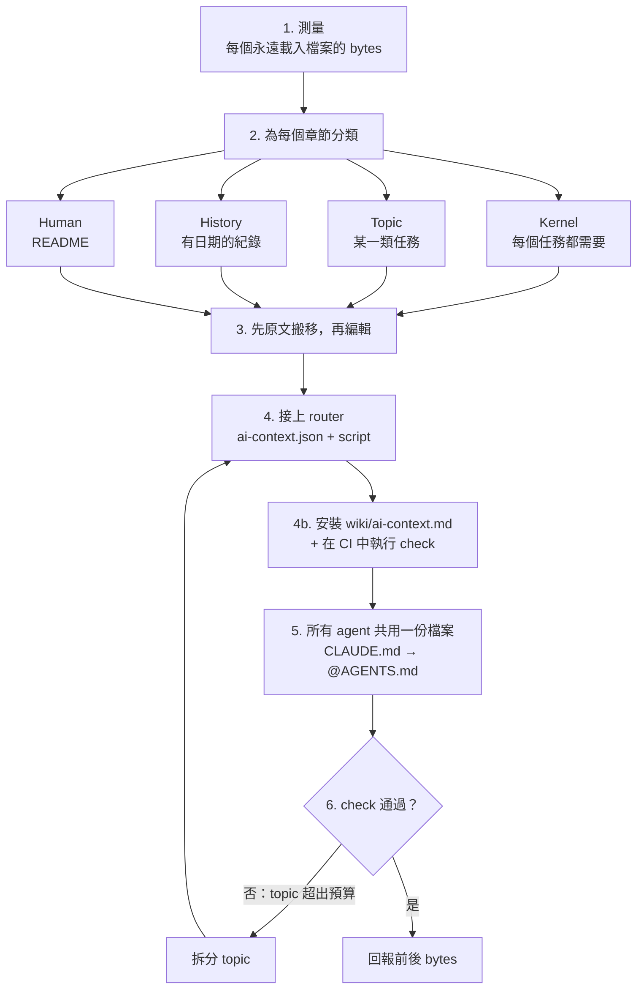
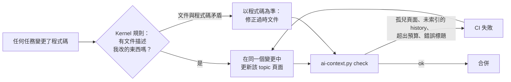

# agents-context-router

[English](README.md) | [日本語](README.ja.md) | [한국어](README.ko.md) | [简体中文](README.zh-CN.md) | **繁體中文**

**你的 `AGENTS.md`，是每個任務都得繳的稅。** 這個 skill 把它瘦身成 5 KB 的 kernel，其餘內容只在任務需要時才載入。

每個 coding agent（Claude Code、Codex、Cursor、Gemini CLI）在動手之前，都會先讀你的根目錄指示檔。專案做了半年，這個檔案裡塞滿了里程碑紀錄、工具清單、部署 runbook、除錯日誌，還有一條關鍵規則被埋在第 400 行。修一個錯字這種一行的小事，也得為這一切付出 context、token 和注意力。

更糟的是，真正重要的規則會被淹沒。想像一份 14 KB 的 `AGENTS.md`，唯一提到 *「絕對不要在 shared 上執行 `make reset-db`」* 的地方，藏在一份 2026-03 的驗收紀錄裡，沒有任何 agent 會認真讀它。

```
Before                                  After
────────────────────────────────────    ─────────────────────────────────────────────
AGENTS.md    14 KB  every task          AGENTS.md              3–5 KB  every task
CLAUDE.md     3 KB  drifted copy        CLAUDE.md              @AGENTS.md (1 line)
README.md    85 KB  "read this first"   docs/ai-context.json   topic → exact sections
                                        scripts/ai-context.py  list | <topic> | check
                                        wiki/<topic>.md        loaded only when needed
                                        wiki/history/*.md      never loaded by default
```

這套做法來自一個真實的正式環境 repo：85 KB 的 README 加上冗長的 `AGENTS.md`，變成了 **5 KB 的 kernel，外加 9 個各 1.5–10 KB 的 topic**。Agent 再也不會略過那些重要的規則。

## 任務如何載入 context



Kernel 維持精簡，agent 才會仔細讀。每個 topic 只在任務需要時載入，歷史紀錄則靜靜待在一旁，直到有人要找它。

## 使用情境

> **「Codex 老是無視最上面的規則。」** 一位獨立開發者的 `AGENTS.md` 已經膨脹到 38 KB，滿是 sprint 筆記和 make target 表格，關鍵規則全被雜訊淹沒。這個 skill 把它砍成 4 KB 的 kernel，硬性限制放在最上面。Sprint 筆記移到 `wiki/history/`，make target 則變成 `build` topic。

> **「Claude Code 和 Codex 對我們的 port 範圍意見不一。」** 一個團隊同時維護 `CLAUDE.md` 和 `AGENTS.md` 兩份完整副本，早在幾個月前就已經不同步。這個 skill 把它們合併成一份 `AGENTS.md`，`CLAUDE.md` 變成 `@AGENTS.md`。兩處衝突整理成表格交給人來決定，因為默默選邊可能會搞壞部署。

> **「那個教訓我們付出慘痛代價才學到，然後又忘了。」** 一次事故之後，有人在 `AGENTS.md` 後面附上了兩頁的事後檢討。這個 skill 把教訓濃縮成一條 kernel 規則（「當所有 vendor 同時失敗時，先懷疑我們自己的網路；載入 `debugging`」），完整的檢討報告則原封不動移到 history。

> **「我只是想加一份 runbook。」** 幾個月後，一位維護者要加一份重試策略 runbook。這個 skill 把它放進 topic 頁面、在 JSON 裡建立對應，並在 kernel 加上一列表格。`check` 確認 kernel 只多了 89 bytes，而不是 2 KB。

> **「三個月後，wiki 內容還正確嗎？」** 一位同事修改了重試邏輯，依照 kernel 規則，在同一個 PR 裡更新了 `wiki/retry-policy.md`。另一位新增了 `wiki/cache.md`，卻忘了建立對應。`check` 在 CI 中以 *"wiki page no topic loads"* 失敗，趕在這個頁面對所有 agent 隱形之前攔下來。

> **「CI 說某個 topic 超出預算。」** `check` 以 `deploy: 21003 B > 16384` 失敗。這個 skill 不會調高上限，而是把 `deploy` 拆成 `release` 和 `rollback`，因為一個 topic 大到這種程度，其實就是兩種任務。

## 你的 agent 會怎麼做

說一句 *「我們的 AGENTS.md 太大了，幫我拆開」*，agent 就會依序完成六個步驟：



1. **測量**所有永遠載入的內容。
2. **分類**每個章節，歸入四個類別之一：kernel、topic、history 或 human。判斷標準是：*「少了這一行，在不相關的任務上會不會做出錯誤的動作？」*
3. **先原文搬移**，再進行編輯，確保沒有任何內容悄悄消失。
4. **接上 router**：一份把每個 topic 對應到精確章節的 JSON，加上一支零相依的 script。
5. **讓所有 agent 共用一份檔案**：不同步的副本變成一行 `@AGENTS.md` 指標，衝突會攤開給你看，而不是默默解決。
6. **驗證**：執行 `check`，並回報前後的位元組數。

之後每個任務都會這樣開始：

```sh
$ python3 scripts/ai-context.py list
build-deploy       Repo layout, build and test commands, deploy procedure.
debugging          Something fails: triage order, logs, known failure codes.
cli-tools          tp-replay / tp-audit usage and flags.

$ python3 scripts/ai-context.py debugging     # prints ONLY what debugging needs
<!-- wiki/debugging.md -->
## Debugging
...
<!-- wiki/tools.md § Failure codes -->
### Failure codes
...
```

## 為什麼不自己拆檔就好？

你當然可以，但不出一個月就會回到原樣。比起「把東西搬進 `docs/`」，這個 skill 多做了這些：

| 沒有 skill | 有 skill |
|---|---|
| Agent「保險起見」把 `docs/*` 全部載入 | Kernel 明訂：只挑 **一個** topic，跨越邊界時才載入第二個 |
| 行號範圍的參照每次編輯都會壞掉 | 採用 **精確標題** 參照，標題被改名或重複時會 **fail closed** |
| Shell 區塊裡的 `# comment` 被誤判成標題 | Parser 會忽略 fenced code 裡的標題 |
| Kernel 又慢慢膨脹回 20 KB | `check` 強制執行 **位元組預算**（kernel 8 KB、每個 topic 16 KB），解法永遠是拆分，絕不調高上限 |
| 新增的 topic 沒有任何 agent 知道 | Topic 沒出現在 `AGENTS.md` 表格中時，`check` 就會失敗 |
| `CLAUDE.md` 和 `AGENTS.md` 悄悄出現分歧 | 只有一個來源，另一個 agent 拿到的是指標檔 |
| Skill 重述規則，然後各自分岔 | Skill 變成 adapter，只說「載入 topic X」 |
| 規則藏在歷史紀錄裡 | 分類流程會把它們拉進 kernel |
| 重構一個月後文件就開始腐爛 | **自我維護**：一條「變更時同步修正過時文件」的 kernel 規則、一份 repo 內手冊，以及 CI 中的孤兒檢查 |

它還附上了 [`references/gotchas.md`](skills/agents-context-router/references/gotchas.md)：從一次真實拆分中整理出的 21 個陷阱，每一個都說明了為什麼會踩雷。光這份檔案就值得一顆星。

## 真的有幫助嗎？

我們用同一個模型，在有和沒有這個 skill 的情況下，各跑了三個貼近實務的任務：
- 拆分一份 14 KB 的 `AGENTS.md`；
- 整併一份不同步的 `CLAUDE.md`；
- 在已經接好 router 的 repo 中新增一份 runbook。

每份產出都由 script 化的檢查項目評分。

| | 有 skill | 沒有 skill |
|---|---|---|
| 通過的檢查 | **33 / 33 (100%)** | 21 / 33 (64%) |

Baseline 漏掉了什麼：
- 把易變的狀態（「41/120 done」）留在永遠載入的檔案裡。
- 讓 deploy skill 保留自己的一份規則副本。
- 沒有提供任何載入 topic 或強制執行預算的方法。
- 改寫了里程碑紀錄，而不是原文搬移。
- 完全沒有安裝自我維護機制：沒有保持文件正確的規則、沒有 repo 內手冊，也沒有孤兒檢查。

過程中也抓到了一次退化。某個早期版本曾經讓一條藏在舊紀錄裡的規則（「絕對不要在 shared 上執行 `make reset-db`」）被一起丟進 history。現在這個 skill 在搬移每份紀錄之前，都會先 grep 出仍然有效的規則，重跑之後就通過了。

這個 skill 每次執行大約多花 25 秒和 6k tokens。樣本數不大（每個版本的每個任務 n = 1 次）。Prompt 都放在 [`evals/`](skills/agents-context-router/evals/)，歡迎重現結果並送 PR。

## 快速開始

### 使用 [skillshare](https://github.com/runkids/skillshare)

```bash
# global: every project on this machine
skillshare install runkids/agents-context-router
skillshare sync

# project only: installs into ./.skillshare/skills
skillshare install runkids/agents-context-router -p
skillshare sync -p
```

### 使用 [Vercel Skills CLI](https://github.com/vercel-labs/skills)

```bash
# project (default): installs for the agents detected in this repo
npx skills add runkids/agents-context-router

# global, for every agent
npx skills add runkids/agents-context-router -g -a '*'
```

### 手動安裝

```bash
git clone https://github.com/runkids/agents-context-router
cp -r agents-context-router/skills/agents-context-router ~/.claude/skills/   # Claude Code
cp -r agents-context-router/skills/agents-context-router ~/.codex/skills/    # Codex
```

接著在任何 repo 裡說：

> **「我們的 AGENTS.md 太大了，把它拆成 kernel 和 wiki topic。」**

其他說法也能觸發它，例如：「CLAUDE.md 和 AGENTS.md 不同步了」、「不要每個 session 都載入里程碑歷史」，或是「加這份 runbook，但別讓 AGENTS.md 變胖」。

## 30 秒看懂 router

`docs/ai-context.json` 是唯一的真實來源（single source of truth）：

```json
{
  "budgets": { "rootInstructionsMaxBytes": 8192, "defaultTopicMaxBytes": 16384 },
  "topics": {
    "debugging": {
      "description": "Something fails: triage order, logs, known failure codes.",
      "sources": [
        { "path": "wiki/debugging.md" },
        { "path": "wiki/tools.md", "heading": "Failure codes" }
      ]
    }
  }
}
```

一個 source 可以是整份檔案，也可以是某個精確的標題。一個章節會延伸到下一個同級或更高層級的標題為止。每個印出的章節都帶有 `<!-- path § heading -->` 標記，讓 agent 去編輯原始檔，而不是輸出的副本。

`scripts/ai-context.py` 是單一的 Python 檔案，只用標準函式庫，沒有任何相依套件。把 `check` 放進 CI：

```sh
$ python3 scripts/ai-context.py check
AGENTS.md            3095 B  (cap 8192)
build-test            512 B  (cap 16384)
deploy                556 B  (cap 16384)
debugging            1249 B  (cap 16384)
ok
```

## 自我維護

大多數文件重構都會逐漸失效：程式碼一路往前走，卻沒人更新頁面。這裡的維護機制就住在 **你的 repo 裡**，所以即使移除了這個 skill，或是從來沒裝過它的 agent，也照樣有效：



它由四個部分組成：
- **Kernel 規則「保持文件正確」。** 每個 agent 在每個任務都會載入它：當你改變了某個 topic 所描述的行為，就在同一個變更中更新該頁面；當文件與程式碼矛盾時，以程式碼為準，並修正文件。
- **`wiki/ai-context.md`。** 一份 repo 內手冊，說明如何新增、搬移和拆分 topic。任何 agent 都能用 `ai-context.py ai-context` 載入它。
- **孤兒檢查。** 當某個 wiki 頁面沒有被任何 topic 載入、某個 history 檔案沒列在索引中，或某個巢狀的 `AGENTS.md` 沒有被任何 topic 載入時，`check` 就會失敗。
- **CI 整合。** 這個 skill 會把 `check` 加進你既有的 `test`、Makefile、pre-commit 或 GitHub Actions job。

## 裡面有什麼

| 路徑 | 內容 |
|---|---|
| [`SKILL.md`](skills/agents-context-router/SKILL.md) | 工作流程：測量 → 分類 → 搬移 → 接線 → 驗證 → 回報 |
| [`references/gotchas.md`](skills/agents-context-router/references/gotchas.md) | 21 個陷阱，以及每個陷阱為何重要 |
| [`scripts/ai-context.py`](skills/agents-context-router/scripts/ai-context.py) | Router：`list`、`<topic>`、`check` |
| [`assets/`](skills/agents-context-router/assets/) | 範本：kernel `AGENTS.md`、`ai-context.json`、`wiki/README.md`，以及 repo 內維護手冊 `wiki/ai-context.md` |
| [`evals/`](skills/agents-context-router/evals/) | 任務 eval（`evals.json`）與觸發 eval（`trigger-evals.json`） |

## 常見問題

**Cursor、Gemini CLI、Aider 等工具也能用嗎？** 可以。Router 只是純 markdown 加上一支 script，任何能執行 `python3` 的 agent 都能使用。這個 skill 會要求 agent 查閱各工具目前的文件，確認是否原生支援 `AGENTS.md`，而不是憑空假設。

**Agent 不會跳過、不載入 topic 嗎？** Kernel 會為每個重要的 topic 保留一行觸發條件（「如果每次執行都以同樣方式失敗，先懷疑我們自己的程式碼；載入 `debugging`」）。觸發條件永遠會載入，runbook 則不會。

**拆分之後，誰來維持 wiki 的正確性？** 每個 agent，在每個任務中都會。Kernel 規則要求它更新自己的變更所影響的 topic，而 CI 會在出現孤兒頁面或損壞的標題時失敗。請見[自我維護](#自我維護)。

**那我的歷史和里程碑紀錄呢？** 它們會以原本的語言，原文搬移到 `wiki/history/`。沒有任何內容會被摘要掉，這個 skill 還會比對前後的總位元組數來證明這一點。

**我可以保留給人看的文件嗎？** 可以。`README.md` 繼續留給人閱讀（簡介、快速開始、文件地圖），而 `wiki/README.md` 則是一張與 JSON 同步、給人看的 router 表格。

## 授權條款

MIT
